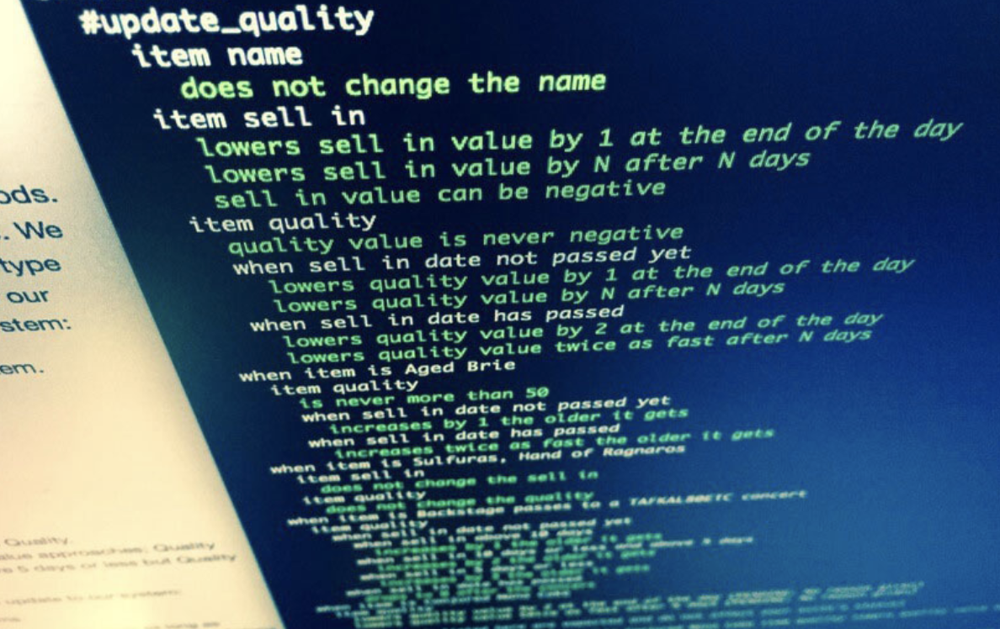

# Gilded Rose

## Refactoring Kata



### Specifications:

[Click here](specification)

## To do's / Tests to write

```
All items have a SellIn value which denotes the number of days we have to sell the item

All items have a Quality value which denotes how valuable the item is

At the end of each day our system lowers both values for every item
```

- [x] Done

```
Once the sell by date has passed, Quality degrades twice as fast
```

- [x] Done

```
"Aged Brie" actually increases in Quality the older it gets
```

- [x] Done

```
The Quality of an item is never more than 50
```

- [x] Done

```
"Sulfuras", being a legendary item, never has to be sold or decreases in Quality
```

- [x] Done

```
"Backstage passes", like aged brie, increases in Quality as its SellIn value approaches;
Quality increases by 2 when there are 10 days or less and by 3 when there are 5 days or less but
Quality drops to 0 after the concert
```

- [x] Done

```
an item can never have its Quality increase above 50
```

- [x] Done

# In Progress

```
"Sulfuras" is a legendary item and as such its Quality is 80 and it never alters.
```

- [x] Done-ish / doesnt have to be 80 atm

```
The Quality of an item is never negative
```

- []

```
"Conjured" items degrade in Quality twice as fast as normal items
```

- []
